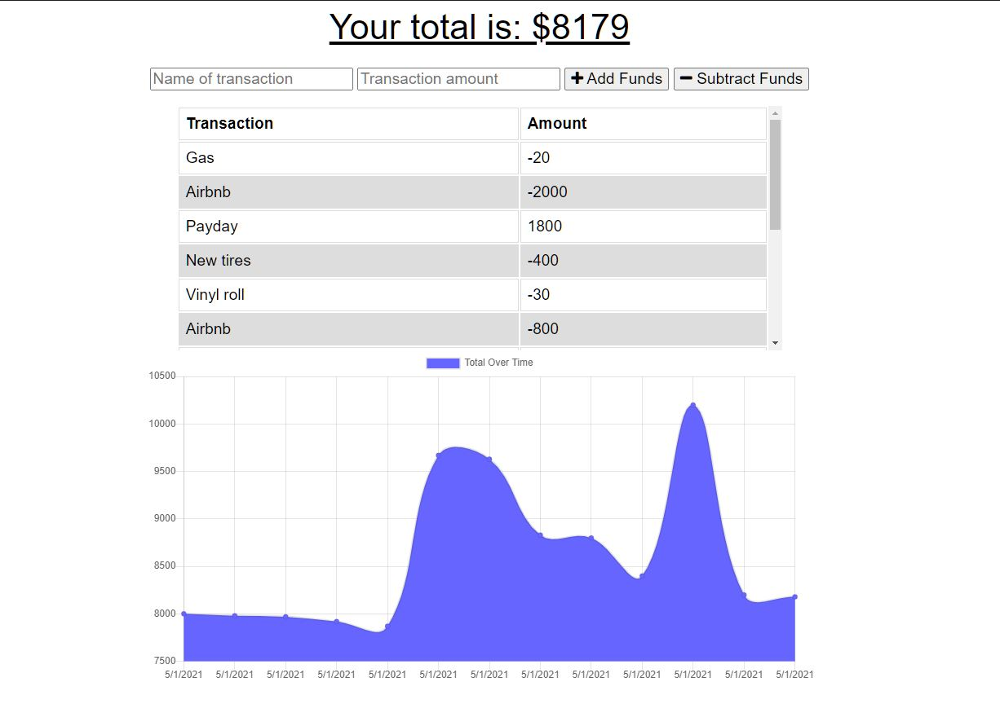

# Budget Wise

## Table of Contents
* [Description](#description)
* [Live Site](#live)
* [The Challenge](#challenge)
* [The Criteria](#criteria)
* [Usage](#usage)

## Description 
Budget tracker to help nomads while they travel.

## Live Site 
[Budget Wise](https://budget-wise-bootcamp.herokuapp.com/)

## The Challenge 
AS AN avid traveler
I WANT to be able to track my withdrawals and deposits with or without a data/internet connection
SO THAT my account balance is accurate when I am traveling 

## The Criteria 
GIVEN a budget tracker without an internet connection
1. WHEN the user inputs an expense or deposit
    * THEN they will receive a notification that they have added an expense or deposit
1. WHEN the user reestablishes an internet connection
    * THEN the deposits or expenses added while they were offline are added to their transaction history and their totals are updated

## Usage 
ISC License

Copyright (c) 2021 Ian Jackson